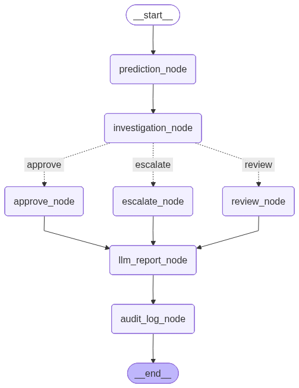
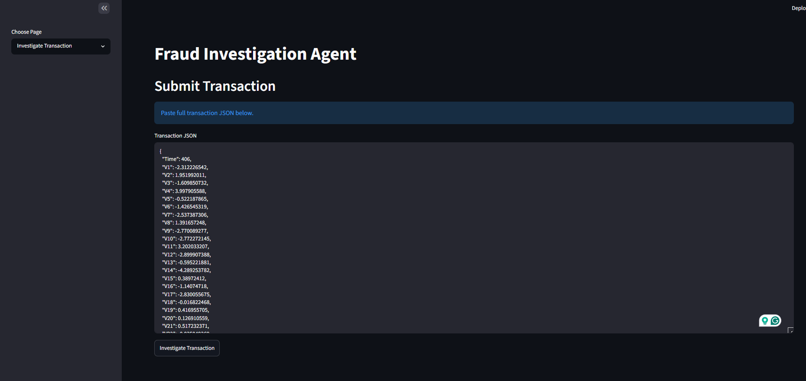
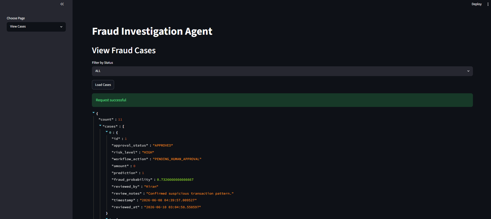
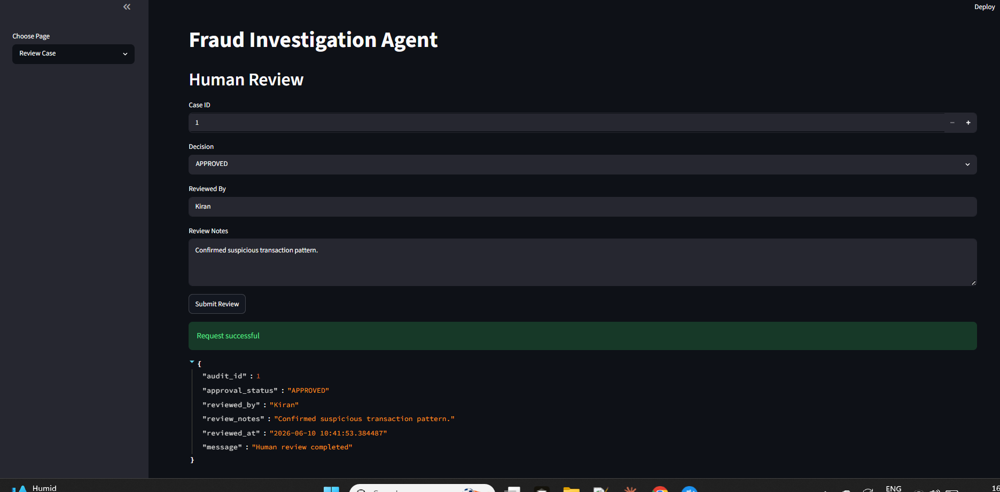
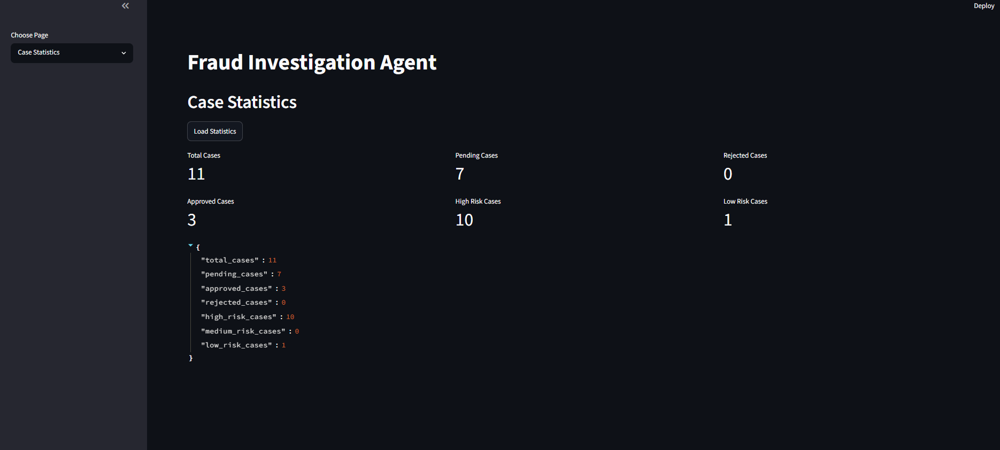

# Fraud Investigation Agent

An end-to-end AI-powered Fraud Investigation Agent built using FastAPI, Machine Learning, LangChain, LangGraph, SQLite, Streamlit, and Docker.

## Features

### Fraud Detection

* Fraud Prediction using Machine Learning
* Fraud Probability Scoring
* Risk Classification (LOW, MEDIUM, HIGH)

### Agentic AI Workflow

* LangGraph-based Investigation Workflow
* Conditional Routing based on Risk Level
* AI-generated Investigation Reports
* LangGraph Checkpointing

### Tool Integration

* Fraud Rules Tool
* Similar Case Lookup Tool

### Human-in-the-Loop Review

* Manual Approval Workflow
* Case Review and Decision Tracking
* Audit Trail for Investigation Decisions

### Notifications

* Email Notifications for High-Risk Fraud Cases

### Dashboard

* Streamlit Dashboard
* Investigation Interface
* Case Management Interface
* Analytics Dashboard

### Deployment

* Dockerized Application
* Docker Compose Support

---

## Tech Stack

### Backend

* FastAPI
* Python

### Machine Learning

* Scikit-learn
* Pandas
* Joblib

### LLM & Agent Framework

* LangChain
* LangGraph
* OpenAI GPT-4o

### Database

* SQLite
* SQLAlchemy

### Frontend

* Streamlit

### Deployment

* Docker
* Docker Compose

---

## Workflow

```text
Transaction
↓
Fraud Prediction
↓
Investigation Analysis
↓
Fraud Rules Tool
↓
Risk Routing

LOW
↓
Auto Approve

MEDIUM
↓
Manual Review

HIGH
↓
Similar Case Lookup Tool
↓
Email Notification
↓
Human Approval Required

↓
LLM Investigation Report
↓
Audit Logging
↓
Case Management
```

---

## LangGraph Workflow



---

## API Endpoints

### Fraud Investigation

#### POST /agent/investigate

Analyze a transaction and generate:

* Fraud Prediction
* Risk Assessment
* Investigation Summary
* Fraud Alerts
* Similar Case Analysis
* AI Investigation Report

### Human Review

#### POST /cases/{audit_id}/review

Approve or reject high-risk fraud cases.

### Case Management

#### GET /cases

Retrieve all fraud investigation cases.

#### GET /cases/{audit_id}

Retrieve a specific case.

#### GET /cases?status=PENDING

Filter cases by status.

### Analytics

#### GET /cases/stats

Returns:

* Total Cases
* Pending Cases
* Approved Cases
* Rejected Cases
* High Risk Cases
* Medium Risk Cases
* Low Risk Cases

---

## Example Investigation Response

```json
{
  "prediction": 1,
  "fraud_probability": 0.7326,
  "risk_level": "HIGH",
  "workflow_action": "PENDING_HUMAN_APPROVAL",
  "requires_human_review": true
}
```

---

## Dataset

This project uses the Credit Card Fraud Detection Dataset.

The original transaction features were anonymized using PCA for privacy reasons.

### Model Features

* Time
* Amount
* V1–V28 (PCA-transformed features)

### Production Equivalent Features

In a real-world fraud detection system, these would typically correspond to:

* Customer Information
* Merchant Details
* Device Information
* Transaction Type
* Location Data
* Behavioral Features

---

## Dashboard Features

### Investigation Page

* Submit Transactions
* Generate Fraud Reports
* View Investigation Results

### Case Management

* View All Cases
* Filter Cases by Status
* View Case Details

### Human Review

* Approve Cases
* Reject Cases
* Add Review Notes

### Analytics

* Investigation Statistics
* Risk Distribution
* Case Metrics

---

## Docker Setup

### Build Docker Image

```bash
docker build -t fraud-agent .
```

### Run Docker Container

```bash
docker run -p 8000:8000 fraud-agent
```

### Docker Compose

```bash
docker compose up --build
```

### Access Services

FastAPI:

```text
http://localhost:8000/docs
```

Streamlit:

```text
http://localhost:8501
```

---

## Screenshots

### Investigation Dashboard



### Case Management



### Human Review



### Analytics Dashboard



---

## Future Enhancements

* Customer History Integration
* External Fraud Intelligence APIs
* Vector Database Memory
* Multi-Agent Fraud Investigation Workflow
* Advanced Fraud Pattern Detection

---

## Author

**Kiran Karakalli**
